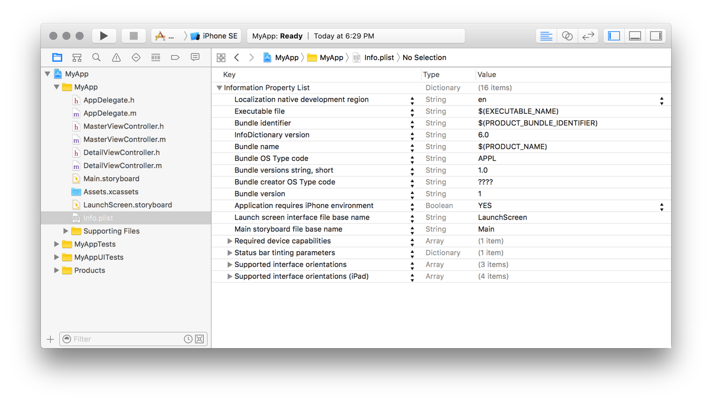
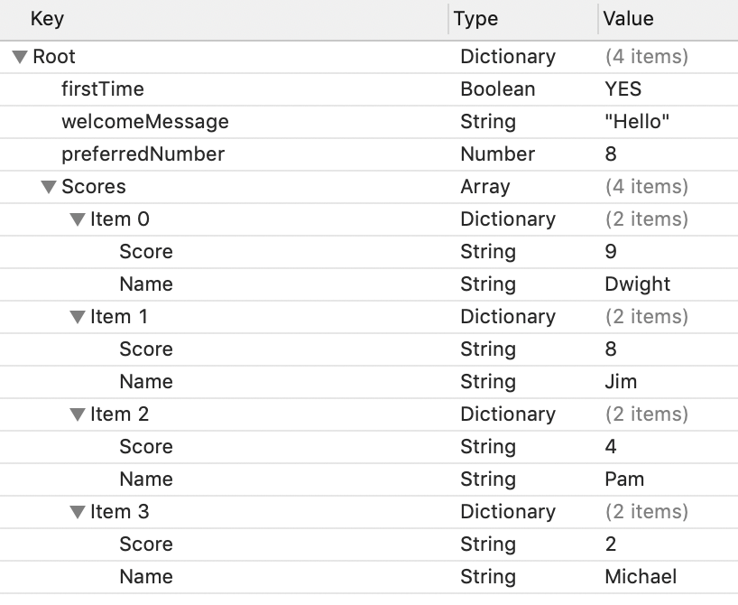
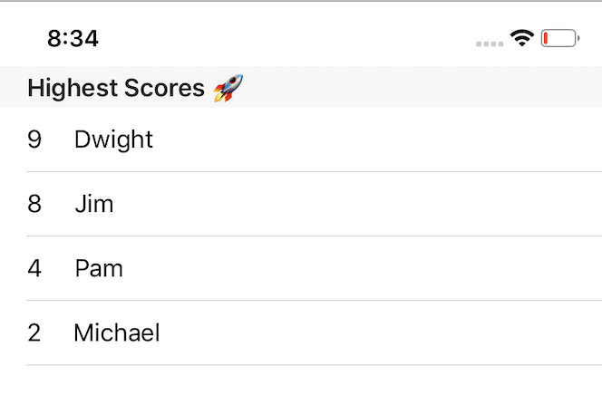

# Plist and UserDefaults

## Minute-by-Minute

| **Elapsed** | **Time**  | **Activity**              |
| ----------- | --------- | ------------------------- |
| 0:00        | 0:05      | Initial Exercise          |
| 0:05        | 0:05      | Objectives                |
| 0:10        | 0:20      | Overview - Plist          |
| 0:30        | 0:30      | In Class Activity I       |
| 1:00        | 0:10      | BREAK                     |
| 1:10        | 0:10      | Overview - NSUserDefaults |
| 1:20        | 0:20      | In Class Activity II.     |
| 1:40        | 0:05      | Wrap Up.                  |
| TOTAL       | 1:45      |                           |

<!-- [Intro To Persistence - Slides](intro-to-persistence.key) OLD SLIDES -->

## Why you should know this or industry application (optional) (5 min)

Explain why students should care to learn the material presented in this class.

## Initial Exercise

### Swift podcasts recommendations:
- [Swift over coffee](https://itunes.apple.com/us/podcast/swift-over-coffee/id1435076502?mt=2) by Paul Hudson and Sean Allen (also on Spotify)<br>
- [Swift community podcast](https://www.swiftcommunitypodcast.org)<br>
- [Swift by Sundell](https://www.swiftbysundell.com/podcast)<br>
- [Swift Unwrapped](https://spec.fm/podcasts/swift-unwrapped)<br>
- [Fireside Swift](https://www.firesideswift.com)

## Learning Objectives (5 min)

By the end of this lesson, students should be able to...

- Identify use cases for persisting information in a plist.
- Use a plist to store and retrieve data.
- Identify use cases for persisting information with UserDefaults in iOS
- Use UserDefaults to store and retrieve data.

## The plist (20 min)

A property list, or plist, is an XML file that contains key-value data. In iOS, a common plist is the `Info.plist` file. An information property list file is a structured text file that contains essential configuration information for a bundled executable.

Typically the contents are structured using XML. The root XML node is always an array or a dictionary, whose contents are a set of keys and values describing the bundle. These values are used by the system to obtain information about the app and its configuration.

The file is called `Info.plist` by convention. The file name is case sensitive so it should have a capital letter I.

The file is created automatically by Xcode when you create a new project.

### Creating an Information Property List File

The easiest way to create an information property list file is letting Xcode create it for us. Every project we create in Xcode comes with a file named `<project>-Info.plist`. The file comes preconfigured with keys that every plist should have.

To edit the contents of the file:

1. Select the file in files inspector.
1. Double-click the value to select it and type a new value.

Most of these values are specified as strings but Xcode also supports other types likes arrays, dictionaries, booleans, date, Data and numbers.


This is an example of a default plist that gets created with every new project. To see the XML structure, we right-click on the file and choose Open As/ Source Code.

### Adding keys
The default `Info.plist` file given by Xcode has the required keys, but it's possible that you will need to add more for your project. We can use the plist as a key-value data store.

- To add a new item, right-click on the editor and select *Add Row*.
- To change the value's type, click on the select button in the Type column.
- To change the value, double-click on the Value column.
- To remove a row, select it and hit Backspace.

### Reading from a plist
We can save information in the form of key-value pairs in a plist. And here's how to read the information:

```Swift
var format = PropertyListSerialization.PropertyListFormat.xml
var data:[String:AnyObject] = [:]
let path:String? = Bundle.main.path(forResource: "name of your plist", ofType: "plist")!
let xmlContents = FileManager.default.contents(atPath: path!)!
do{
    data = try PropertyListSerialization.propertyList(from: xmlContents,options: .mutableContainersAndLeaves,format: &format)as! [String:AnyObject]
    // data is available now
catch{
    print("Error reading plist: \(error)")
}
```

### Writing to a plist
Aside from manually adding new elements to the plist, we can also write to it. The issue here is that we _can't write to our app bundle_. This means we first need to to save the existing file into a Documents folder and then write and read from there.

#### What's the difference?
The **main bundle** is everything that the user gets when they install the app.
- This is read only.
- When the app is updated, the bundle gets replaced by a new one.

The **documents directory** is where everything that the user generates is stored.
- This is read/write
- Remains the same even with updates.

Going back to writing to the plist, we can write small helper methods to help handling plists easier. [This suggestion](https://stackoverflow.com/questions/25100262/save-data-to-plist-file-in-swift) made on StackOverflow keeps all operations on plists contained in a single place and prevents errors caused by typing the wrong file name over and over.

```Swift

struct Plist {
  
  enum PlistError: Error {
    
    case FileNotWritten
    case FileDoesNotExist
  }
  
  let name:String
  
  var sourcePath:String? {
    guard let path = Bundle.main.path(forResource: name, ofType: "plist") else { return nil }
    return path
  }
  
  var destPath:String? {
    guard sourcePath != nil else { return nil }
    let dir = NSSearchPathForDirectoriesInDomains(.documentDirectory, .userDomainMask, true)[0]
    return (dir as NSString).appendingPathComponent("\(name).plist")
  }
  
  init?(name:String) {
    
    self.name = name
    
    let fileManager = FileManager.default
    
    guard let source = sourcePath else { return nil }
    guard let destination = destPath else { return nil }
    guard fileManager.fileExists(atPath: source) else { return nil }
    
    if !fileManager.fileExists(atPath: destination) {
      
      do {
        try fileManager.copyItem(atPath: source, toPath: destination)
      } catch let error as NSError {
        print("Unable to copy file. ERROR: \(error.localizedDescription)")
        return nil
      }
    }
  }
  
  
  func getValuesInPlistFile() -> NSDictionary?{
    let fileManager = FileManager.default
    if fileManager.fileExists(atPath: destPath!) {
      guard let dict = NSDictionary(contentsOfFile: destPath!) else { return nil }
      return dict
    } else {
      return nil
    }
  }
  
  func getMutablePlistFile() -> NSMutableDictionary?{
    let fileManager = FileManager.default
    if fileManager.fileExists(atPath: destPath!) {
      guard let dict = NSMutableDictionary(contentsOfFile: destPath!) else { return nil }
      return dict
    } else {
      return nil
    }
  }
  
  func addValuesToPlistFile(dictionary:NSDictionary) throws {
    let fileManager = FileManager.default
    if fileManager.fileExists(atPath: destPath!) {
      if !dictionary.write(toFile: destPath!, atomically: false) {
        print("File not written successfully")
        throw PlistError.FileNotWritten
      }
    } else {
      throw PlistError.FileDoesNotExist
    }
  }
}


```

## In Class Activity I (30 min)
Create a project and a new plist file. The goal for your plist is to have these items:



Using the methods to handle plists or your own implementation if you want, display the items in the Scores dictionary in a UITableView. It should look something like this:



Try adding new elements to the dictionary both manually and in code. Add two more entries.

In every step you write or each method you use be sure to know what is happening at a lower level in the app's files. Be prepared to explain your implementation when asked.

## UserDefaults (10 min)

UserDefaults allows us to store Strings, Numbers, Dates, Data and Arrays or Dictionaries. Keep in mind that it is a **small** amount of data what we should be storing in UserDefaults.

Usually it should be used to store user preferences, or anything as long as it's a small amount of persistent information.

Every piece of data we store will have a unique *key*, if we try saving things with the same key, new data will only replace the old data.

**Note:**

Should never be used for sensitive data as its not encrypted (eg. Authentication Token, passwords).

**Example - Storing a boolean indicating if a user first downloaded(opened) an app**

```Swift
// Set
UserDefaults.standard.set(false, forKey: "FirstTimeUser")

// Get
let value = UserDefaults.standard.bool(forKey: "FirstTimeUser")
```

**Example - Storing a string**

```Swift
// Set
UserDefaults.standard.set("Karl", forKey: "name")

// Get
let name = UserDefaults.standard.string(forKey: "name") ?? ""
```

Items stored in UserDefault belong to an app. This means deleting your app will clear out its UserDefaults.

## In Class Activity II (20 min)

Let's say we want to manage saving a user's token with UserDefaults. We will be accessing this token in several parts within the app. We can make the process of requesting data much easier if we have the UserDefault request in one place only, in a way that we can reuse that piece of code.

Complete the implementation of this helper struct and then test it out to see if you can successfully store and retrieve the token.

```Swift
   struct Defaults {

        static let token = "token"
        static let tokenKey = "tokenKey"

        struct Model {
            var token: String?

            init(token: String) {
              //complete the initializer
            }
        }

        static var saveToken = { (token: String) in
          //complete the method
        }

        static var getToken = { () -> Model in
          //complete the method
        }

        static func clearUserData(){
          //complete the method using removeObject
        }
    }

```

**Q:** Is there potential to extend the Model struct to represent an object? How would the methods and the initializer change? <br>
**Q:** What are some use cases for the code you just completed?

## Resources
[Plist - article](https://learnappmaking.com/plist-property-list-swift-how-to/)<br>
[Info.plist - Apple Docs](https://developer.apple.com/library/archive/documentation/General/Reference/InfoPlistKeyReference/Articles/AboutInformationPropertyListFiles.html#//apple_ref/doc/uid/TP40009254-102276)<br>
[Apple Documentation on UserDefaults](https://developer.apple.com/documentation/foundation/userdefaults)<br>
[Plist struct](https://stackoverflow.com/questions/25100262/save-data-to-plist-file-in-swift)
[User defaults - exercise](https://medium.com/@nimjea/userdefaults-in-swift-4-d1a278a0ec79)
