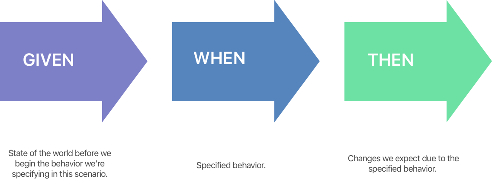

# Unit Testing

## Minute-by-Minute

| **Elapsed** | **Time**  | **Activity**              |
| ----------- | --------- | ------------------------- |
| 0:00        | 0:05      | Objectives                |
| 0:05        | 0:15      | Overview                  |
| 0:20        | 0:45      | In Class Activity I       |
| 1:05        | 0:10      | BREAK                     |
| 1:15        | 0:45      | In Class Activity II      |
| TOTAL       | 2:00      |                           |

## Why you should know this or industry application

We all know how time consuming it is to make manual testing. It looks something like this: We build and run the app, navigate a few screens, make a few taps and make sure everything works the right way. If everything is good we move on to repeating the same process for different test cases. With unit testing we can automate some of these processes to cut time in testing while still making sure our app works as intended.

## Learning Objectives (5 min)

1. Describe the importance of unit testing.
1. Define unit testing
1. Design & implement basic tests in an Xcode project.
1. Navigate Xcode to create and run tests.

## Initial Exercise (15 min)

- Funny comic
- Prime the Pump (e.g. think and jot, think pair share, etc)
- Productivity Tip/Tool
- Review of current event (e.g. tech news relevant to your track/topic)
- Quiz on homework or topic(s) of past class
- Concept Test

## Overview (20 min)
### What is unit testing?

Unit testing is a level of software testing where individual units/ components of a software are tested. The purpose is to validate that each unit of the software performs as designed.

A unit is the smallest testable part of any software. (ex. a method)

### Benefits of unit tests

The faster we can build features, the faster users get updates in their apps. We increase the peace in which we develop if we can trust our existing code while rolling out new features. Making sure the newly added code doesn't break our existing code. That's when unit tests really show their value.
- You can detect bugs earlier and fix them faster.
- Saving time means saving resources and money.
- Users are happy with an app that doesn't break with every update.
- Refactoring is easier and gives you more confidence to improve without breaking.

**Q:** What are other benefits that come to mind?

### What can we test?

- Models
- Methods
- Interactions with view controllers
- UI workflows

## In Class Activity I (30 min)

The first unit test.

Steps:
1. Create a new project including unit test targets.
1. Embed the current ViewController in a Navigation Controller and add a title to it.
1. Move to the unit test file and add the following test:
```Swift
func titleTest() {
        let storyboard = UIStoryboard(name: "Main", bundle: nil)
        let login = storyboard.instantiateInitialViewController() as! ViewController
        let _ = login.view
        XCTAssertEqual("Practice Project", login.title)
}
```
1. Command + U to run all tests OR click the diamond button on each test.

Keyterms:
- XCTest
- @testable import ProjectName
- XCTAssertEqual

Now you do another unit test, find something small in the app you can test.<br>
All tests should pass.

## Overview/TT

### Given When Then



## In Class Activity II (optional) (30 min)

Try a few tests in a playground.<br>
Take a look at [this gist](https://gist.github.com/annjose/1baa75b0796d0d2fef1a10ab74d5bd65) and try it yourself.

<!--Overview of UI Testing? -->
<!--Overview of Code coverage? -->

## Wrap Up (5 min)

- Highly recommended to complete the tutorial listed in additional resources.
- Keep practicing with small tests.


## Additional Resources

1. [Unit testing tutorial](https://www.raywenderlich.com/709-ios-unit-testing-and-ui-testing-tutorial)
1. [XCTest in Apple's Docs](https://developer.apple.com/documentation/xctest)
1. [Book resource (not free)](https://roadfiresoftware.com/unit-testing-in-swift/)
1. [A LOT of testing resources](https://medium.com/flawless-app-stories/a-complete-list-of-articles-on-unit-testing-with-swift-from-2017-9be8f046ef25)
1. [Testing techniques](https://www.marisibrothers.com/2017/03/common-unit-testing-techniques-on-ios.html#1a)
