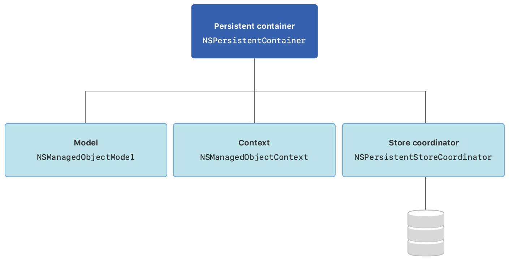
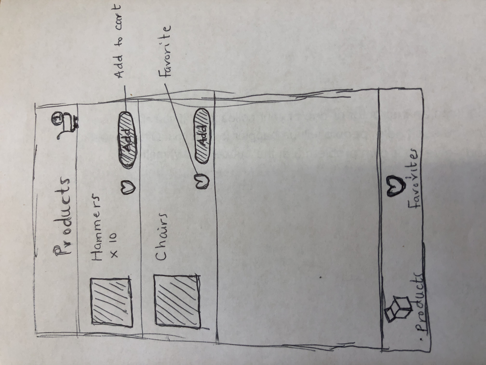

# Intro to CoreData

## Minute-by-Minute [OPTIONAL]

| **Elapsed** | **Time**  | **Activity**              |
| ----------- | --------- | ------------------------- |
| 0:00        | 0:05      | Objectives                |
| 0:05        | 0:15      | Overview                  |
| 0:20        | 0:45      | In Class Activity I       |
| 1:05        | 0:10      | BREAK                     |
| 1:15        | 0:45      | In Class Activity II      |
| TOTAL       | 2:00      |                           |

## Class Materials

[CoreData - Intro](core_data_intro.pdf)

## Why you should know this or industry application (optional) (5 min)

Explain why students should care to learn the material presented in this class.

## Learning Objectives (5 min)

1. Describe CoreData, what it is and how it works.
1. Design models to use with CoreData.
1. Understand key concepts and components of CoreData.

## Overview (20 min)

Core Data is a framework that you use to manage the model layer objects in your application. It provides generalized and automated solutions to common tasks associated with object life cycle and object graph management, including persistence.

Use Core Data to save your application’s permanent data for offline use, to cache temporary data, and to add undo functionality to your app on a single device.

Through Core Data’s Data Model editor, you define your data’s types and relationships, and generate respective class definitions. Core Data can then manage object instances at runtime to provide the following features.

- Persistence
Core Data abstracts the details of mapping your objects to a store, making it easy to save data from Swift and Objective-C without administering a database directly.
- Background Data Tasks
Perform potentially UI-blocking data tasks, like parsing JSON into objects, in the background. You can then cache or store the results to reduce server roundtrips.
- View Synchronization
Core Data also helps keep your views and data synchronized by providing data sources for table and collection views.

### Creating a Core Data Model
The first step in working with Core Data is to create a data model file. Here you define the structure of your application’s objects, including their object types, properties, and relationships.
You can add a Core Data model file to your Xcode project when you create the project, or you can add it to an existing project.

Add Core Data to a New Xcode Project
In the dialog for creating a new project, select the Use Core Data checkbox.

The resulting project includes an .xcdatamodeld file.

Add a Core Data Model to an Existing Project
Choose File > New > File and select from the iOS templates. Scroll down to the Core Data section, and choose Data Model:

Click Next. Name your model file, and select its group and targets.

An .xcdatamodeld file with the name you specified is added to your project:

### Setting Up a Core Data Stack
 Set up the classes that collaboratively support your app’s model layer. These classes are referred to collectively as the Core Data stack.

 

- An instance of NSManagedObjectModel represents your app’s model file describing your app’s types, properties, and relationships.
- An instance of NSManagedObjectContext tracks changes to instances of your app’s types.
- An instance of NSPersistentStoreCoordinator saves and fetches instances of your app’s types from stores.
- An instance of NSPersistentContainer sets up the model, context, and store coordinator all at once.

Instructions to set up a Persistence Container [here](https://developer.apple.com/documentation/coredata/setting_up_a_core_data_stack).

## In Class Activity I (15 min)

Define in your own words the following key terms and save them for future reference.

- Object Graph
- Queries
- NSManagedObject
- NSEntityDescription
- NSManagedObjectContext
- NSPersistentStoreCoordinator
- NSPersistentStore
- NSManagedObjectModel

## In Class Activity II (15 min)

Diagram how you think core data components work in the app described below. Include all the components needed.

**Favorites:**
Lets create a User. A "logged in" *User* will have only one cart. You can add products to this cart.
We will also have favorites, a "logged in user" can favorite many products.

8. Create a *User* NSManagedObject.
9. There should be only one instance of a user in your app.
10. Add a favorites tab. Users can *favorite* products, and that will appear on the favorites tab.

*Sample App Image*

## In Class Activity II (30 min)

Clone the this repo:

[MakeInventory CoreData App Starter](https://github.com/Product-College-Labs/MakeInventory)

**And:**

1. Add the date the inventory was entered to the Inventory model and display it.
2. Edit an inventory item and save the changes.
3. Add way to delete an inventory item.

**Extra:**

Lets model a shopping cart. There will only be one *Cart*. A Cart can have many *Products*. *Products* can belong to only one *Cart*.

1. Create a *Products* and *Cart* entity
2. Create the one-to-many and one-to-one relationships between the entities.
3. Create some dummy *products* and display them in a list.(You can have them as saved instances of NSManagedObjects).
4. Have a add to cart button on each *Product* cell in the list.
5. When a user taps the *Add to Cart* button, you add the product to the cart.
6. When a user taps the Cart button, it displays the cart with all the *products*.
7. Make sure to save the cart every time a new item is added to it. If the app is closed and opened, the *products* in the cart should persist.
